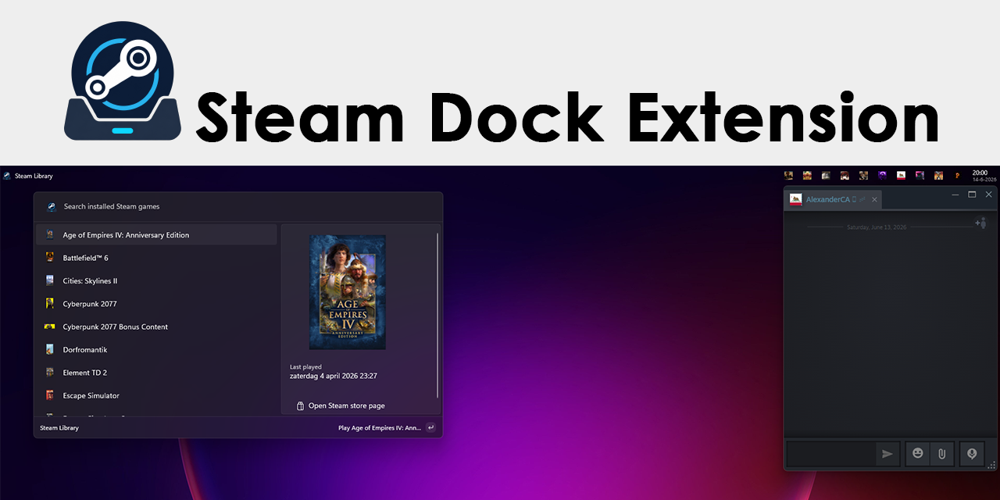

# Steam Dock Extension



A PowerToys Command Palette extension with two Dock experiences:

Repository: <https://github.com/ScymicX/Steam-Dock-Extension>

- **Steam Library**: a searchable alphabetical list of locally installed games.
- **Online Steam Friends**: a live Dock band showing online friends and the game they are playing.

## Data sources

The library is read locally from Steam's `libraryfolders.vdf` and
`appmanifest_*.acf` files. Artwork is loaded from Steam's local
`appcache/librarycache` when available.

Online friends use Valve's `ISteamUser/GetFriendList` and
`ISteamUser/GetPlayerSummaries` Web API methods.

The Steam profile used for the Dock band must have **Friends List** set to
**Public** under **Edit Profile > Privacy Settings**. Valve returns HTTP 401
for `GetFriendList` when that setting is private, even when the API key is valid.

## Configuration

Open the extension settings in Command Palette and configure:

- **Steam Web API key**: create one at <https://steamcommunity.com/dev/apikey>.
  A key entered in the settings is stored in Windows Credential Manager. Leave
  the field blank to keep the stored key, enter `CLEAR` to remove it, or set the
  `STEAM_WEB_API_KEY` environment variable instead.
- **SteamID64**: optional. The extension automatically selects the most recent user from
  Steam's `config/loginusers.vdf`.
- **Steam installation folder**: optional override.
- **Maximum online friends** and **refresh interval**.

Other settings are stored in the package's local application data. Existing
plain-text API keys from development builds are migrated to Windows Credential
Manager when the extension starts.

## Requirements

- Windows 10 version 2004 or newer
- Microsoft PowerToys with Command Palette and Dock support
- A local Steam installation for the library
- An optional Steam Web API key for online friends

## Build and test

1. Open `SteamDockExtension.sln` in Visual Studio. Do not open only the `.csproj`;
   the solution contains the deployment mappings used by Visual Studio.
2. Select the `SteamDockExtension (Package)` profile.
3. Use **Build > Deploy SteamDockExtension**.
4. In Command Palette, run **Reload Command Palette extensions**.
5. Enable the Dock and add the Steam Library and Online Steam Friends bands.

The user controls whether each band appears in the Start, Center, or End Dock region.

The project has an explicit `Deploy` target. It builds the project, copies the package
assets into the loose MSIX layout, and registers that layout with Windows. Repeated
deployments first stop and unregister the running development build so its files are
not locked. Windows Developer Mode must be enabled for development package registration.

For a local parser check without deploying the extension:

```powershell
dotnet run --project SteamDockExtension.Diagnostics
```

## Create a Store package

On Windows with the .NET 10 SDK and Windows SDK installed:

```powershell
.\Publishing\Build-StorePackage.ps1
```

The unsigned x64/ARM64 bundle is written to `artifacts/store` for Partner
Center. See [the release checklist](Publishing/RELEASE_CHECKLIST.md) for Store
and WinGet publication.

## Privacy and license

Steam Dock Extension has no developer-owned server, analytics, or telemetry.
See [PRIVACY.md](PRIVACY.md), [SECURITY.md](SECURITY.md), and
[LICENSE](LICENSE).

Steam and the Steam logo are trademarks and/or registered trademarks of Valve
Corporation. This independent project is not affiliated with or endorsed by
Valve Corporation or Microsoft.
